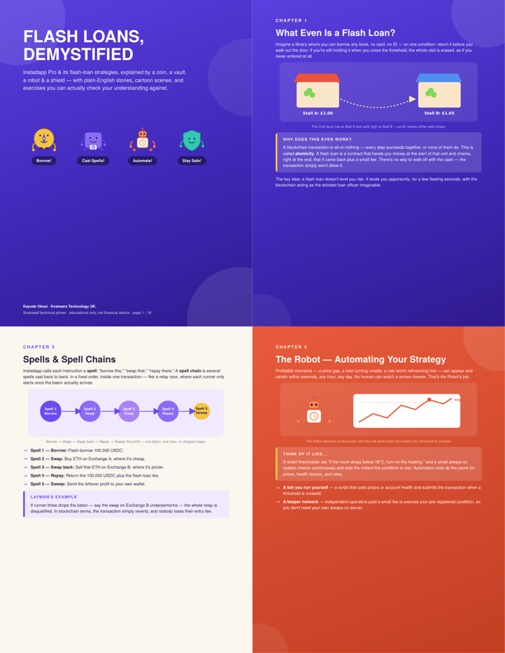

# Flash Loans, Demystified 🪙

**A cartoon field guide to flash loans and Instadapp Pro's spell-based automation — told by a coin, a vault, a robot, and a shield.**

[]()
[]()
[]()
[]()

<p align="center">
  
</p>

---

## What this is

Flash loans are one of the most powerful — and most intimidating — primitives in DeFi. Most explanations jump straight into Solidity, atomic composability, and calldata before a reader has any intuition for *why* any of it works.

This guide takes the opposite approach: every concept is introduced as a **story or a real-world analogy first**, illustrated with a small cast of cartoon characters, and then backed up with the precise technical explanation. Each chapter ends with an exercise and an answer key, so it doubles as a self-study worksheet, not just a read-through.

It covers flash loans themselves, Instadapp Pro's DSA (Decentralized Smart Account) model, spells and spell chains, protocol connectors, automation/keeper bots, and a field guide to the most common flash-loan strategies (arbitrage, collateral swap, debt refinance, leverage loops) — closing with a chapter on the risks worth guarding against before deploying any of it with real funds.

## Meet the cast

| Character | Represents |
|---|---|
| 🪙 **The Coin** | The borrowed money — huge, free for a moment, and it must go home before the transaction ends |
| 🗄️ **The Vault** | Your DSA (Decentralized Smart Account) on Instadapp Pro, which holds and casts "spells" |
| 🤖 **The Robot** | Automation — the bot or keeper network that watches the market and pulls the trigger for you |
| 🛡️ **The Shield** | Safety — the checks and fail-safes that stop a clever idea from becoming an expensive mistake |

<p align="center">
  
</p>

## What's inside

| # | Chapter | Page |
|---|---|---|
| 1 | What Even Is a Flash Loan? | 3 |
| — | Exercise: Flash Loan Basics | 4 |
| 2 | Meet Instadapp Pro — The Vault | 5 |
| 3 | Spells & Spell Chains | 6 |
| — | Exercise: Order the Spells | 7 |
| 4 | Connectors — The Universal Adapters | 8 |
| 5 | The Robot — Automating Your Strategy | 9 |
| — | Exercise: Spot the Trigger | 10 |
| 6a | Strategy Field Guide, Part 1 (Arbitrage & Collateral Swap) | 11 |
| 6b | Strategy Field Guide, Part 2 (Refinance & Leverage Loops) | 12 |
| — | Exercise: Match the Strategy | 13 |
| 7 | The Shield — Staying Safe | 14 |
| 8 | Final Quiz & Glossary | 15 |
| 9 | About This Guide & The GitHub Project | 16 |

## Repository structure

```
flash-loans-demystified/
├── README.md
├── LICENSE
├── src/
│   └── guide.html              # Single-file HTML/CSS source — the guide's source of truth
├── dist/
│   └── Flash-Loans-Instadapp-Pro-Cartoon-Guide.pdf   # Built, ready-to-read PDF
├── scripts/
│   └── build.py                 # Renders src/guide.html -> dist/*.pdf via WeasyPrint
└── assets/
    └── preview/
        ├── cover.png
        └── sample-pages.png
```

The entire guide — layout, gradients, character illustrations, and cartoon scenes — is written as a single self-contained `guide.html` file. All four mascots and every scene diagram are inline SVG, styled with plain CSS (no build tooling, no JS framework, no external assets). This keeps the project trivially forkable: clone it, open `src/guide.html` in a browser to preview instantly, tweak the CSS variables/colors, and re-render.

## Getting started

### Read it
Just open [`dist/Flash-Loans-Instadapp-Pro-Cartoon-Guide.pdf`](dist/Flash-Loans-Instadapp-Pro-Cartoon-Guide.pdf) — no build step required.

### Build it yourself
The PDF is generated from the HTML/CSS source using [WeasyPrint](https://weasyprint.org/).

```bash
git clone https://github.com/<your-username>/flash-loans-demystified.git
cd flash-loans-demystified

pip install weasyprint

python scripts/build.py
# -> writes dist/Flash-Loans-Instadapp-Pro-Cartoon-Guide.pdf
```

### Preview while editing
Since the source is plain HTML/CSS, you can skip the PDF step entirely while iterating — just open `src/guide.html` directly in a browser tab to see your changes live (each "page" is a fixed 8.5in × 11in `<div>`, so it previews close to true-to-print).

## Customizing / forking

A few things that are easy to change if you want to retheme or extend this:

- **Colors** — every page background is one of a handful of named gradient classes (`.bg-purple`, `.bg-teal`, `.bg-coral`, `.bg-navy`, `.bg-gold`, `.bg-cream`) defined at the top of the `<style>` block. Change the gradient stops there to retheme the whole guide at once.
- **Characters** — the four mascots are defined once as reusable `<g id="icon-coin">`, `<g id="icon-vault">`, `<g id="icon-robot">`, `<g id="icon-shield">` SVG groups, referenced via `<use>` elsewhere. **Important:** because of a WeasyPrint quirk, `<use>` only resolves correctly when its `<defs>` block lives in the *same* `<svg>` element as the `<use>` — cross-`<svg>` references silently fail to render. Each scene that reuses a mascot therefore carries its own local copy of the relevant `<defs>`. If you add a new scene, copy the icon `<defs>` block into it too rather than relying on the shared one at the top of the file.
- **New chapters** — each page is a `<div class="page">` with a background layer, a `.content` wrapper, and (optionally) an inline `<svg class="scene">` illustration. Copy an existing page block as a template.
- **Exercises** — each exercise follows the same `.quiz-q` / `.answer-box` pattern, so new ones are easy to add without touching CSS.

## Who this is for

- Developers new to DeFi automation who want the mental model before the Solidity.
- Product and business stakeholders who need the concepts in plain English before a technical conversation.
- Anyone curious how a flash loan actually works under the hood without wading through a protocol whitepaper first.

## Contributing

Issues and pull requests are welcome — new chapters, corrections, additional exercises, or translations are all fair game. A few guidelines:

1. **Open an issue before structural changes.** New chapters or reordering existing ones should be discussed first so the narrative stays consistent chapter to chapter.
2. **Keep the story-first, technical-second pattern.** Every new concept should get a plain-English analogy or scene before (or alongside) the precise explanation.
3. **Every exercise needs an answer key.** Don't add a question without its answer directly below it.
4. **Test your render.** Run `python scripts/build.py` and check the output PDF's page count and layout before opening a PR — WeasyPrint will silently create a blank extra page if a page's content overflows its fixed height, so tight text/illustration sizing matters.

## Disclaimer

This guide is **educational only**. It is not financial advice, and none of the strategies described (flash arbitrage, collateral swaps, debt refinancing, leverage loops, or any other flash-loan strategy) should be deployed with real funds without your own independent testing, auditing, and risk assessment.

## License

Content and illustrations: consider licensing under [CC BY-NC-SA 4.0](https://creativecommons.org/licenses/by-nc-sa/4.0/) (free to share and adapt, non-commercial, with attribution). Source code (the HTML/CSS/build script) can reasonably sit under [MIT](https://opensource.org/licenses/MIT). Pick whichever fits your intent and add the corresponding `LICENSE` file(s) before publishing — this repo doesn't ship one by default.

## Author

**Kayode Okosi** · Knatware Technology UK
Contact: [kayode@knatware.com](mailto:kayode@knatware.com)
